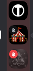
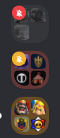

# QuickServerMute

Un plugin [BetterDiscord](https://betterdiscord.app/) qui ajoute un bouton de mute en un clic sur chaque serveur **et dossier** de la barre de gauche, avec un indicateur visuel clair pour voir d'un coup d'œil ce qui est muet.

Marre de faire clic droit serveur après serveur et de passer par le menu juste pour couper les notifications ? Ce plugin place un petit bouton cloche directement sur chaque icône de serveur et sur chaque dossier.

## Fonctionnalités

- **Mute/démute en un clic** — un petit bouton cloche sur chaque icône de serveur.
- **Support des dossiers** — mute/démute tous les serveurs d'un dossier en un seul clic.
- **État visuel** — les serveurs muets affichent un bouton cloche rouge qui reste visible, et leur icône est grisée. Un dossier est rouge quand tous ses serveurs sont muets et orange quand seulement une partie l'est.
- **Bouton au survol** — sur les éléments non muets, le bouton n'apparaît qu'au survol de l'icône, pour garder la liste propre.
- **Mise à jour en direct** — si tu modifies les notifications ailleurs dans Discord, l'indicateur se met à jour automatiquement.
- **Confirmation** — une petite notification confirme chaque mute/démute.
- **Accessible au clavier** — le bouton est atteignable avec `Tab` et déclenchable avec `Entrée` / `Espace`.

## États visuels

| Serveurs | Dossier |
| --- | --- |
|  |  |

Une cloche rouge signifie muet, une cloche orange signifie qu'une partie seulement du dossier est muette, et les icônes grisées sont les serveurs muets.

## Comment ça marche

Discord ne propose pas de bouton de mute par serveur (ni par dossier) dans la liste des serveurs, ce plugin en ajoute donc un :

1. Il surveille la liste des serveurs (`data-list-item-id="guildsnav___<serverId>"` pour les serveurs et `guildsnav___<folderId>` pour les dossiers) avec un `MutationObserver`.
2. Pour chaque serveur, il injecte un petit bouton dans le coin supérieur gauche de l'icône.
3. Le clic sur le bouton d'un serveur appelle l'action interne `updateGuildNotificationSettings` de Discord pour passer ce serveur en muet (permanent) ou non muet.
4. Le clic sur le bouton d'un dossier fait la même chose pour tous les serveurs qu'il contient (tout muter si ce n'est pas déjà le cas, tout démuter sinon). Les dossiers sont récupérés via le store `SortedGuildStore` de Discord.
5. L'état est lu depuis le store interne `UserGuildSettingsStore` de Discord, et l'interface est rafraîchie à chaque événement de mise à jour des paramètres de serveur.

Aucune donnée ne quitte ton client. Le plugin utilise uniquement les API internes de Discord, exactement comme l'option clic droit → *Sourdine* / *Mute Server*.

## Prérequis

- Discord Desktop (le plugin ne fonctionne **pas** sur la version navigateur).
- [BetterDiscord](https://betterdiscord.app/) installé.

## Installation

1. Installe [BetterDiscord](https://betterdiscord.app/) si ce n'est pas déjà fait (ferme Discord, lance l'installeur, puis rouvre Discord).
2. Télécharge `QuickServerMute.plugin.js` depuis ce dépôt.
3. Place le fichier dans le dossier des plugins de BetterDiscord :
   - **Windows :** `%AppData%\BetterDiscord\plugins`
   - **macOS :** `~/Library/Application Support/BetterDiscord/plugins`
   - **Linux :** `~/.config/BetterDiscord/plugins`
   - Le dossier est créé automatiquement au premier lancement de BetterDiscord.
4. Dans Discord, ouvre **Paramètres → BetterDiscord → Plugins**.
5. Active **QuickServerMute** avec l'interrupteur.

Les boutons apparaissent immédiatement sur la barre des serveurs.

## Utilisation

- **Survole** une icône de serveur : un bouton cloche apparaît dans le coin supérieur gauche.
- **Clique** sur la cloche pour muter le serveur. Le bouton devient rouge et reste visible.
- **Clique** à nouveau pour démuter.
- Les serveurs muets ont aussi leur icône grisée pour les repérer rapidement.
- **Les dossiers** fonctionnent de la même façon : survole un dossier et clique sur sa cloche pour muter tous les serveurs qu'il contient. Clique à nouveau pour tous les démuter. Le bouton du dossier est rouge quand tous ses serveurs sont muets et orange quand seulement une partie l'est.

## Dépannage

- **Aucun bouton n'apparaît / le mute ne fait rien :** ouvre la console développeur (`Ctrl+Maj+I`) et cherche les messages `[QuickServerMute]`, puis ouvre une issue avec les logs. Discord met régulièrement à jour ses modules internes et les sélecteurs peuvent nécessiter un petit correctif.
- **Le bouton n'est pas visible :** survole l'icône du serveur — le bouton est masqué jusqu'au survol pour les serveurs non muets.

## Désinstallation

1. Désactive **QuickServerMute** dans **Paramètres → BetterDiscord → Plugins**.
2. Supprime `QuickServerMute.plugin.js` du dossier des plugins.

## Avertissement

Ce plugin utilise des modules internes et non documentés de Discord. Ils peuvent changer à tout moment et casser le plugin jusqu'à sa mise à jour. À utiliser à tes risques.

## Licence

MIT
